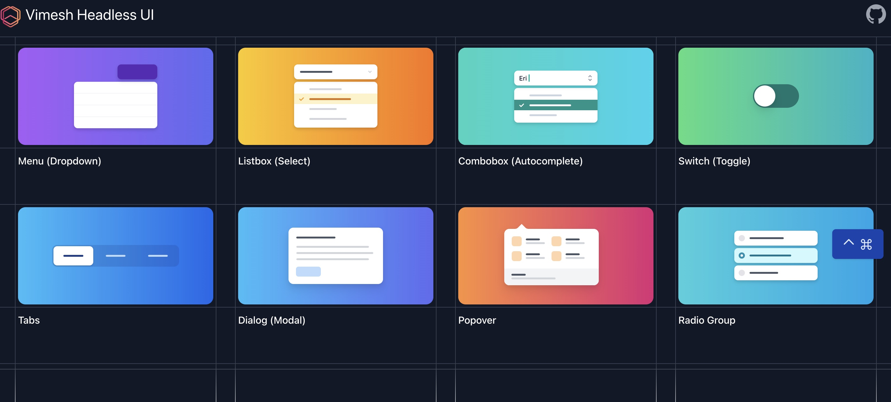
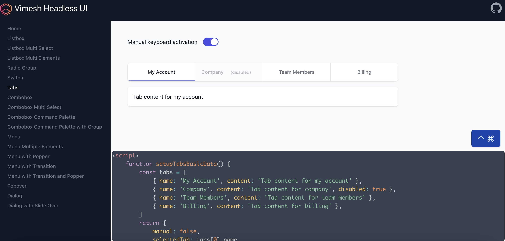

<div align="right">
  <details>
    <summary >🌐 Language</summary>
    <div>
      <div align="center">
        <a href="https://openaitx.github.io/view.html?user=vimeshjs&project=vimesh-headless&lang=en">English</a>
        | <a href="https://openaitx.github.io/view.html?user=vimeshjs&project=vimesh-headless&lang=zh-CN">简体中文</a>
        | <a href="https://openaitx.github.io/view.html?user=vimeshjs&project=vimesh-headless&lang=zh-TW">繁體中文</a>
        | <a href="https://openaitx.github.io/view.html?user=vimeshjs&project=vimesh-headless&lang=ja">日本語</a>
        | <a href="https://openaitx.github.io/view.html?user=vimeshjs&project=vimesh-headless&lang=ko">한국어</a>
        | <a href="https://openaitx.github.io/view.html?user=vimeshjs&project=vimesh-headless&lang=hi">हिन्दी</a>
        | <a href="https://openaitx.github.io/view.html?user=vimeshjs&project=vimesh-headless&lang=th">ไทย</a>
        | <a href="https://openaitx.github.io/view.html?user=vimeshjs&project=vimesh-headless&lang=fr">Français</a>
        | <a href="https://openaitx.github.io/view.html?user=vimeshjs&project=vimesh-headless&lang=de">Deutsch</a>
        | <a href="https://openaitx.github.io/view.html?user=vimeshjs&project=vimesh-headless&lang=es">Español</a>
        | <a href="https://openaitx.github.io/view.html?user=vimeshjs&project=vimesh-headless&lang=it">Italiano</a>
        | <a href="https://openaitx.github.io/view.html?user=vimeshjs&project=vimesh-headless&lang=ru">Русский</a>
        | <a href="https://openaitx.github.io/view.html?user=vimeshjs&project=vimesh-headless&lang=pt">Português</a>
        | <a href="https://openaitx.github.io/view.html?user=vimeshjs&project=vimesh-headless&lang=nl">Nederlands</a>
        | <a href="https://openaitx.github.io/view.html?user=vimeshjs&project=vimesh-headless&lang=pl">Polski</a>
        | <a href="https://openaitx.github.io/view.html?user=vimeshjs&project=vimesh-headless&lang=ar">العربية</a>
        | <a href="https://openaitx.github.io/view.html?user=vimeshjs&project=vimesh-headless&lang=fa">فارسی</a>
        | <a href="https://openaitx.github.io/view.html?user=vimeshjs&project=vimesh-headless&lang=tr">Türkçe</a>
        | <a href="https://openaitx.github.io/view.html?user=vimeshjs&project=vimesh-headless&lang=vi">Tiếng Việt</a>
        | <a href="https://openaitx.github.io/view.html?user=vimeshjs&project=vimesh-headless&lang=id">Bahasa Indonesia</a>
        | <a href="https://openaitx.github.io/view.html?user=vimeshjs&project=vimesh-headless&lang=as">অসমীয়া</
      </div>
    </div>
  </details>
</div>

# Vimesh Headless UI
## Features
This is Alpine.js implementation of [Tailwind Headless UI](https://headlessui.com/). Built with [Vimesh UI](https://github.com/vimeshjs/vimesh-ui) framework, Vimesh Headless UI has some nice features:
### Ultra lightweight 
Vimesh Headless UI has much smaller code size

| Components   | Vimesh Headless UI   | Tailwind Headless UI for Vue | Tailwind Headless UI for React |
| ----------- | -------------------- | -------- | ----- |
| Listbox   | 8k  | 34k | 30k | 
| Combobox  | 9k  | 25k | 39k |
| Menu      | 7k  | 18k | 20k |
| Switch    | 0.6k | 5k | 6k |
| Tabs      | 4k  | 12k | 16k |
| Dialog    | 2k  | 15k | 17k |
| Popover   | 6k  | 23k | 28k |
| Radio Group | 1k | 11k | 14k |

Comparing the production version of Vimesh and Tailwind headless dialog example page size, Vimesh is much smaller with more features and less bugs (check the menu display in the tailwind popup dialog). 

* Vimesh (192k) 
 
* Tailwind (425k)


### Load only used components dynamically
Components are plain html files, which could be hosted anywhere, normally at CDN. They could be shared cross different projects without extra tree shaking magic. For example, the dialog basic example uses two components `hui-dialog` and `hui-menu`. Just load them asynchronously with `x-import`. Vimesh UI registers corresponding native custom elements and initialize them.

```html
<template x-component:page="dialog-basic" x-import="hui:dialog,menu" x-data="setupDialogBasicData()"
    class="overflow-y-auto">
    ...
    <hui-dialog :open="isOpen" @close="setIsOpen(false)">
        ...
        <hui-menu>
        </hui-menu>
    </hui-dialog>
    ...
</template>
```

### No build, no bundle
What you write is what you get. Organize components to html files under meaningful namespaces. You do not need webpack, rollup, vite etc. 

## Getting Started
### Development mode
Install development dependencies, including alpinejs, @vimesh/style, @vimesh/ui, universal-router and http-server.
```
yarn
```
Run static http server
```
yarn dev
```
Open the url `http://127.0.0.1:8080/playground/dev.html`

It shows an index page


There are many examples for different components with relative source code.



It uses development version of alpinejs and @vimesh/ui in the node_modules folder. 

### Production mode
Please check `playground/index.html`, which use the latest alpinejs and @vimesh/ui at `unpkg.com`. In fact it is also what you would do if you use Vimesh Headless UI in your real projects.
``` html
<head>
    <link rel="icon" type="image/x-icon" href="./assets/favicon.ico">

    <script src="https://unpkg.com/@vimesh/style"></script>
    <script src="https://unpkg.com/@vimesh/ui"></script>
    <script src="https://unpkg.com/alpinejs" defer></script>
    <script src="https://unpkg.com/universal-router/universal-router.min.js"></script>

    <script>
        const DEBUG = false
        $vui.config.debug = DEBUG
        $vui.config.importMap = {
            "hui": '../components/${component}.html' + (DEBUG ? '?v=' + new Date().valueOf() : '?v=0.1'),
            "app": './components/${path}${component}.html' + (DEBUG ? '?v=' + new Date().valueOf() : '?v=0.1'),
            "page": './pages/${path}${component}.html' + (DEBUG ? '?v=' + new Date().valueOf() : '?v=0.1'),
        }
    </script>
    ...
</head>
```

[Online Playground](https://unpkg.com/@vimesh/headless/playground/index.html)

Yes, the online playground are 100% plain html hosted at `unpkg.com`. It is very old school style, right? Let's make frondend development back to what it should be.