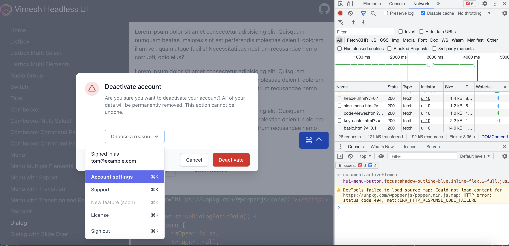
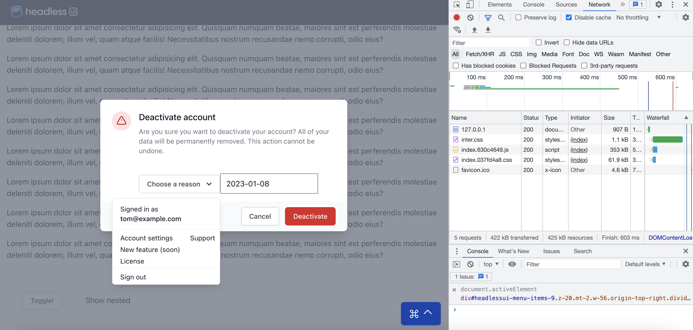

# Vimesh Headless UI
This is Alpine.js implementation of [Tailwind Headless UI](https://headlessui.com/). Built with [Vimesh UI](https://github.com/vimeshjs/vimesh-ui) framework, Vimesh Headless UI has some unique features:
## Ultra lightweight 
Vimesh Headless UI has much less code size

| Component   | Vimesh Headless UI   | Tailwind Headless UI for Vue | Tailwind Headless UI for React |
| ----------- | -------------------- | -------- | ----- |
| Listbox   | 8k  | 34k | 30k | 
| Combobox  | 9k  | 25k | 39k |
| Menu      | 7k  | 18k | 20k |
| Switch    | 0.6k | 5k | 6k |
| Tabs      | 4k  | 12k | 16k |
| Dialog    | 2k  | 15k | 17k |
| Popover   | 6k  | 23k | 28k |
| Radio Group | 1k | 11k | 14k |

Comparing the production version of Vimesh and Tailwind headless dialog example page size, Vimesh is much smaller with more features and less bugs (check the menu display in the popup dialog). 

| Vimesh | Tailwind |
| ---- | ---- |
|  |  |
| 192k | 425k |

## Load only used components dynamically
Components are plain html files, which could be hosted anywhere, normally at CDN. They could be shared cross different projects without extra tree shaking magic. For example, the dialog basic example uses two components `hui-dialog` and `hui-menu`. Just load them asynchronously with `x-import`, [Vimesh UI](https://github.com/vimeshjs/vimesh-ui) registers native custom elements and initialize them.

```html
<template x-component:page="dialog-basic" x-import="hui:dialog,menu" x-data="setupDialogBasicData()"
    class="overflow-y-auto">
    ...
    <hui-dialog :open="isOpen" @close="setIsOpen(false)">
        ...
        <hui-menu>
        </hui-menu>
    </hui-dialog>
    ...
</template>
```

## No build, no bundle
What you write is what you get. Organize components to html files under meaningful namespaces. You do not need webpack, rollup, vite etc. 

## Easy to debug